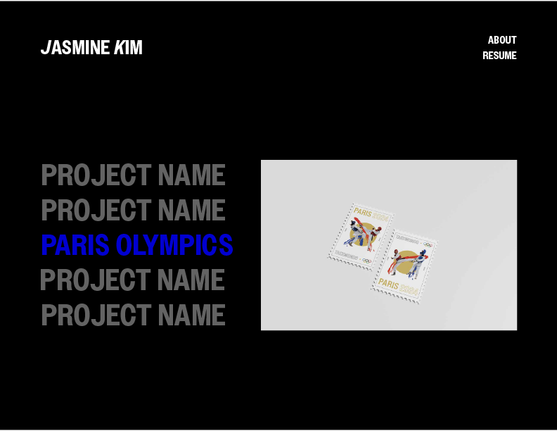
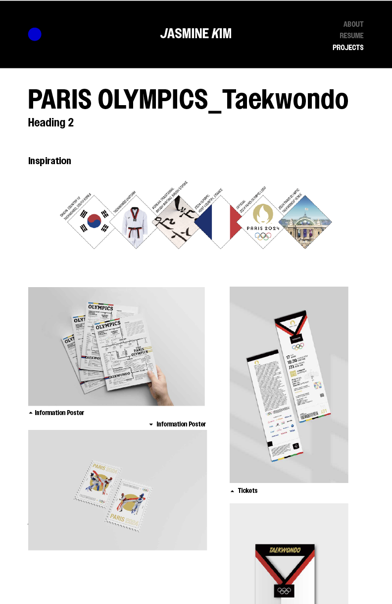
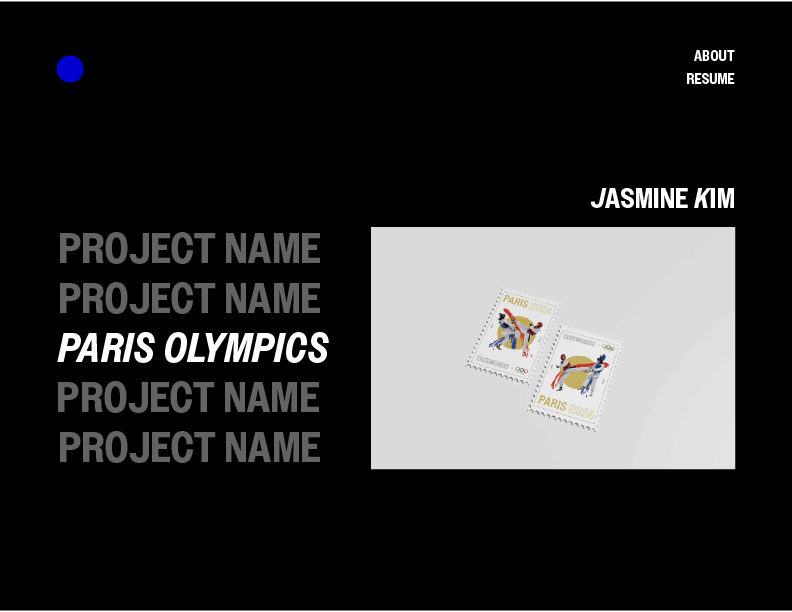
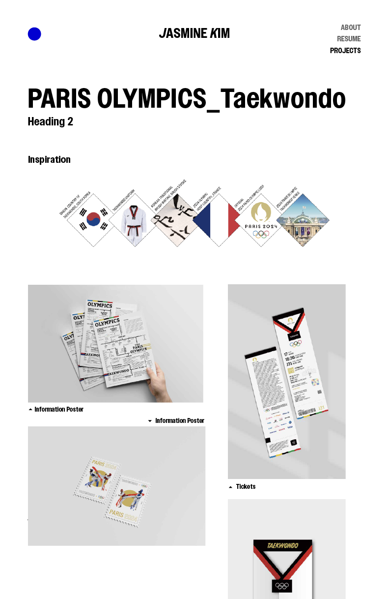
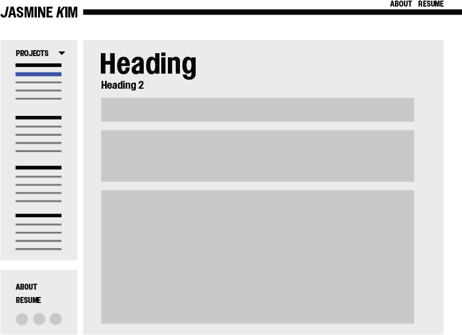
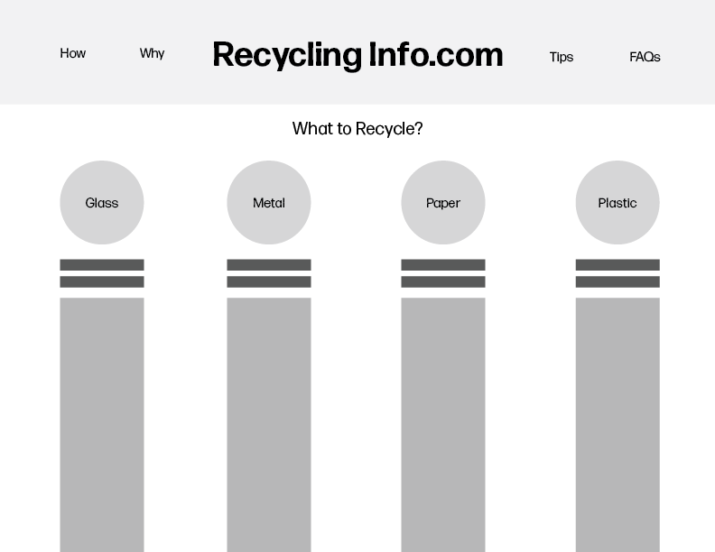
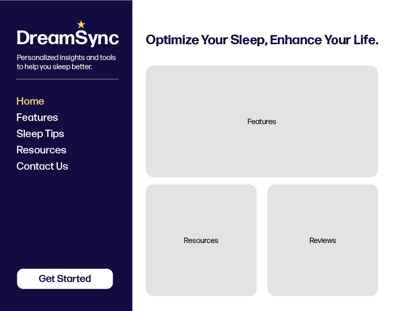

<mark>**Note that this document order from FP4 -> FP1**</mark>

<mark>Please sign up for the study</mark> at [https://tinyurl.com/pui-study](https://tinyurl.com/pui-study) to allow us to use your submission to create a better GenAI assistant for designers!

---

# **FP4 \- Final Project Writeup**

Feel free to refer to this [Markdown Cheat Sheet](https://www.markdownguide.org/cheat-sheet/) to make your writeup more organized, and you can preview your markdown file in VSCode [Markdown editing with Visual Studio Code](https://code.visualstudio.com/docs/languages/markdown#_markdown-preview). 

## Part 1: Website Description

Describe your website (300 words).

* What is the purpose of your website?   
* Who is the target audience?  
* What information do you convey with your website?   
* How is it interesting and engaging? 

## Part 2: User Interaction

How a user would interact with your website? For each step, briefly but clearly state the interaction type & how we should reproduce it.

1. Interaction type. Click on X on page Y / scroll on page X, etc.  
2. 

## Part 3: External Tool

Describe what important external tool you used (JavaScript library, Web API, animations, or other). Following the bulleted list format below, reply to each of the prompts.

1. Name of tool1  
   * Why did you choose to use it over other alternatives? (2 sentences max)  
   * How you used it? (2 sentences max)  
   * What does it add to your website? (2 sentences max)  
2. Name of tool2

## Part 4: Design Iteration

Describe how you iterated on your prototypes, if at all, including any changes you made to your original design while you were implementing your website and the rationale for the changes. (4-8 sentences max)

## Part 5: Implementation Challenge

What challenges did you experience in implementing your website? (2-4 sentences max)

## Part 6: Generative AI Use and Reflection

Describe how you used Generative AI tools to create this final project (fill in the following information, write \~500 words in total).

Document your use of all GenAI tools — ChatGPT, Copilot, Claude, Cursor, etc. using the template below. Add/Delete rows or bullet points if needed, and replace Tool1/Tool2 with the name of the tool.

### Usage Experiences by Project Aspects

Feel free to edit the column \_ (other?) or add more columns if there's any other aspect in your project you've used the GenAI tools for.

For the following aspects of your project, edit the corresponding table cell to answer:
- *Usage*: Whether you used / did not use this tool for the aspect. Enter [Yes/No]
- *Productivity*: Give a rating on whether this tool makes your productivity for X aspect [1-Much Reduced, 2-Reduced, 3-Slightly Reduced, 4-Not Reduced nor Improved, 5-Slightly Improved, 6-Improved, 7-Much Improved].

| Tool Name | Ratings | design | plan | write code | debug | \_ (other?) |
| :---- | :---- | :---- | :---- | :---- | :---- | :---- |
| Tool1 | Usage | Yes/No | Yes/No | Yes/No | Yes/No | Yes/No |
| Tool1 | Productivity | 1~7 | 1~7 | 1~7 | 1~7 | 1~7 |
| Tool2| Usage | Yes/No | Yes/No | Yes/No | Yes/No | Yes/No |
| Tool2 | Productivity | 1~7 | 1~7 | 1~7 | 1~7 | 1~7 |

### Usage Reflection

> Impact on your design and plan 
* It matched my expectations and plan in [FP2](#generative-ai-use-plan) in that … For example, 
  1. Tool1: 
  2. Tool2:
* It did not match my expectations and plan in [FP2](#generative-ai-use-plan) in that … For example, 
  1. Tool1: 
  2. Tool2:
* GenAI tool did/did not influence my final design and implementation plan because … For example, 
  1. Tool1: 
  2. Tool2:

> Use patterns
* I accepted the generations when …  For example, 
  1. Tool1: this tool once suggested … and I adjusted my design according to the suggestion because … 
  2. Tool2: 
* I critiqued/evaluated the generated suggestions by … For example, 
  1. Tool1: this tool once suggested … but I modified/rejected the suggestion because … 
  2. Tool2: 

> Pros and cons of using GenAI tools
* Pros
  1. Tool1: 
  2. Tool2:
* Cons
  1. Tool1: 
  2. Tool2:

### Usage Log

Document the usage logs (prompts and chat history links) for the GenAI tools you used. Some tools may not have an easy way to share usage logs, just try your best! Some instructions for different tools:

1. [ChatGPT](https://help.openai.com/en/articles/7925741-chatgpt-shared-links-faq) / [Gemini](https://support.google.com/gemini/answer/13743730?hl=en&co=GENIE.Platform%3DDesktop): share the anonymous link to all of your chat histories relevant to this project
2. [GitHub Copilot (VSCode)](https://code.visualstudio.com/docs/copilot/copilot-chat#:~:text=You%20can%20export%20all%20prompts%20and%20responses%20for%20a%20chat%20session%20in%20a%20JSON%20file%20with%20the%20Chat%3A%20Export%20Session...%20command%20(workbench.action.chat.export)%20in%20the%20Command%20Palette.): export chat histories relevant to this project.

---

# **FP3 \- Final Project Check-in**

Document the changes and progress of your project. How have you followed or changed your implementation & GenAI use plan and why? Remember to commit your code to save your progress.

## Implementation Plan Updates

- [ ] ...

## Generative AI Use Plan Updates

- [ ] ...

Remember to keep track of your prompts and usage for [FP4 writeup](#part-6-generative-ai-use-and-reflection).

---

# **FP2 \- Evaluation of the Final project**

## Project Description

I'm motivated by my transition from graphic design to UX design. I wanted to move away from my old identity and present myself in a fresh way, so I focused on making my project look visually cool and eye-catching to really grab attention.

## High-Fi Prototypes

### *Prototype 1*

I conducted usability testing on my portfolio website with users navigating sections like About, Projects, and Resume. Feedback was positive, noting the clean design, intuitive navigation, and appealing project displays. However, users recommended larger font sizes for better readability and more interactive features for engagement. 

### *Prototype 2*

Most peers mentioned that the menu section felt too cluttered and suggested changing the background and highlighting the project menu. They appreciated the overall layout but recommended using a unified white background for a cleaner look.

## Usability Test

During the evaluation and usability testing of my portfolio website, I gathered valuable feedback from a diverse set of users. Each participant was given an overview of the website’s purpose and guided through tasks such as navigating the About, Projects, and Resume sections to assess usability and overall design.

Feedback Highlights: The responses were largely positive. Users commended the clean design and intuitive navigation, which made browsing the site straightforward. They found the project presentations particularly appealing, noting that the visual elements effectively highlighted my work. However, there were also key areas for improvement. Several users mentioned that the font sizes were too small, which impacted readability. Others suggested incorporating interactive features to make the site more dynamic and engaging.

Design Updates and Influence on Final Design: I prioritized user feedback to refine the website’s design and enhance the overall user experience. The recommendation to increase font sizes was directly implemented, with adjustments to typography ensuring better readability across all devices. Additionally, I simplified the navigation by reworking the menu structure to make it more accessible and less cluttered. This change aimed to streamline the user journey and help visitors quickly find the sections they were looking for.

The suggestion to add interactive elements inspired new directions for the project. I incorporated subtle hover effects and clickable elements that added a layer of interactivity, making the experience more engaging and visually stimulating. These updates not only responded to user feedback but also aligned with modern web design practices.

Overall, the usability testing provided insights that were crucial to the final design. Implementing the feedback led to a more user-friendly, accessible, and engaging website that better meets the needs and expectations of its audience.

## Updated Designs

Show screenshots of your updated design based on the user feedback (\<100 words, \~2 images).

## Feedback Summary

During the lab session, I received a mix of positive feedback and constructive criticism on my final design. Users appreciated the visual consistency and clean layout, especially the use of bold, readable typography and the clear sections highlighting different projects. The overall aesthetic was noted as modern and professional, aligning well with the intended showcase purpose. However, participants pointed out a few areas for improvement that influenced subsequent adjustments.

Feedback Highlights: One major suggestion was to emphasize important project sections more distinctively. Users felt that the current visual differentiation could be enhanced to make featured projects, like the Paris Olympics section, stand out more clearly. They also recommended simplifying the navigation further, making it easier for users to switch between sections such as About, Projects, and Resume without confusion. The addition of subtle interactive cues, like hover animations, was suggested to enhance the engagement and usability of the site.

Design Influences: I implemented this feedback by updating the project menu to include highlighted titles and distinct visuals, drawing users’ attention to key projects. The menu structure was further streamlined for ease of navigation, ensuring users could access main sections with fewer clicks. Interactive features such as hover effects were added to clickable elements, enhancing the user experience with visual feedback during interactions.

Overall, this feedback helped refine my final design into a more user-friendly and visually engaging portfolio, striking a balance between aesthetics and functionality. The session confirmed the importance of user-centered adjustments and reinforced that even subtle design changes could significantly impact the overall user experience.

## Milestones

As I progress through the semester, my implementation plan will unfold over several weeks. In Week 9, I will focus on finalizing and submitting my FP1 assignment while reviewing feedback from the lab session to identify areas for improvement in my portfolio website. By Week 10, I aim to submit my FP2 assignment and conduct usability testing on the updated design, analyzing user feedback to inform further refinements. In Week 11, I will implement additional changes based on usability test findings, focusing on enhancing mobile responsiveness and optimizing content presentation. Week 12 will involve a peer review session, where I will gather insights on the overall usability and functionality of my website, allowing me to make necessary adjustments. With Thanksgiving break in Week 13, I plan to reflect on my design journey and compile key insights. Finally, in Week 14, I will finalize my portfolio for submission as part of the FP4 assignment, ensuring it effectively showcases my work and the evolution of my design process. This structured approach will keep me on track to deliver a polished, user-centered portfolio by the end of the semester.

### *Implementation Plan*

- [X] Week 9 Oct 28 \- Nov 1:
  - [X] FP1 due
  - [X] Gather feedback on FP1 and identify areas for improvement.
  
- [ ] Week 10 Nov 4 \- Nov 8:   
  - [X] FP2 due
  - [ ] Conduct a usability test on the revised portfolio website to evaluate the new changes.
  - [ ] Analyze user feedback from the usability test to identify further improvements.
  - [ ] Start working on the next set of enhancements based on feedback.

- [ ] Week 11 Nov 11 \- Nov 15:
  - [ ] Implement any additional design changes identified during the usability test.
  - [ ] Focus on optimizing the website for mobile responsiveness and performance.
  - [ ] Create a presentation to showcase the portfolio website and its evolution.
        
- [ ] Week 12 Nov 18 \- Nov 22:
  - [ ] Conduct a peer review session to gather final feedback on the portfolio.
  - [ ] Make any last-minute adjustments based on peer feedback.
  - [ ] Prepare a comprehensive report summarizing the design process, feedback received, and final outcomes.
        
- [ ] Week 13 Nov 25 \- Nov 29:  
  - [ ] Thanksgiving
  - [ ] Reflect on the design journey and compile insights for future projects.
        
- [ ] Week 14 Dec 2 \- Dec 6:  
  - [ ] FP4 due
  - [ ] Ensure the portfolio website is polished and ready for presentation.
  - [ ] Schedule a final review session with your instructor or peers to showcase the completed project and discuss your design process.

### *Libraries and Other Components*

List the JS libraries and other components (if applicable) that you plan to use. 
* React.js: For building the user interface and creating reusable UI components efficiently.
*Bootstrap: To implement responsive design and pre-styled components for faster development.
*GSAP (GreenSock Animation Platform): For adding smooth animations and interactive elements to enhance user engagement.
*Axios: For handling HTTP requests to fetch data if needed (e.g., pulling in dynamic content or API integration).
*Lodash: For simplifying complex JavaScript functions and improving code efficiency.
*Framer Motion: To create sophisticated animations for a more polished, interactive user experience.
*Font Awesome: For incorporating scalable icons and visual elements easily.
*React Router: To handle navigation between different pages and sections of the portfolio.
*styled-components: For writing CSS directly in JavaScript, allowing for better component styling and maintainability.

## Generative AI Use Plan

To implement my portfolio website, I’ll use Generative AI tools to make the process smoother and more efficient. I plan to use ChatGPT for brainstorming ideas, drafting content, and getting quick coding explanations, helping me save time and improve my writing. GitHub Copilot will be great for generating code snippets and automating simpler coding tasks, though I’ll still handle complex parts myself to ensure accuracy. DALL·E will help me create design concepts and mockups for inspiration, but I’ll use other tools for the final visuals. Notion AI will keep my project organized by summarizing notes and managing tasks, while Grammarly will make sure my writing is polished. By combining these tools with my own work, I hope to boost my productivity while maintaining quality and a personal touch.

### *Tool Use*

*ChatGPT
I will use it for brainstorming, writing help, and quick explanations because it boosts creativity and clarity.
I will not use it for complex coding or deep problem-solving due to limited project-specific understanding.

*GitHub Copilot
I will use it for code suggestions and automating simple tasks because it speeds up coding.
I will not use it for complex logic or debugging as it might miss intricate details.

*DALL·E
I will use it for generating design concepts and visual ideas quickly.
I will not use it for polished, brand-specific graphics due to limited precision.

### *Responsible Use*

Using Generative AI responsibly means being transparent about when and where AI-generated content is used and giving proper credit. It's important to check outputs carefully to avoid biases and ensure fairness, as well as to protect privacy by using anonymized data and following data regulations. I would make sure not to create any misleading or harmful content and always have human oversight to review and improve AI outputs for accuracy. Documenting AI use in projects is also essential for accountability. By following these practices, I’d use AI to boost creativity and productivity while staying ethical and trustworthy.

---

# **FP1 \- Proposal for Critique**

## Idea Sketches

### *Idea 1*

* What is the basic idea of your final project? (1-2 sentences)
The basic idea of my final project is to create a UX portfolio website that showcases my design skills, projects, and philosophy. It will serve as an engaging platform to highlight my journey as a   designer and demonstrate my approach to user experience.
* How do you plan to make your design interactive and engaging?
I plan to make the design interactive and engaging by incorporating dynamic elements such as interactive project previews, hover effects, and smooth animations. This will create a lively browsing experience that encourages users to explore my work more deeply.
* How do you plan to make your design accessible?
To ensure accessibility, I will use high-contrast colors, provide descriptive alt text for images, and implement keyboard navigation and screen-reader compatibility. This approach will make the website usable for all visitors, regardless of their abilities.
* What information do you specifically want to convey and include on your website?
I want to convey my design philosophy, process, and the impact of my work through detailed case studies for each project. The website will also include my skills, experiences, and contact information, making it easy for potential employers or collaborators to understand my strengths and reach out.

### *Idea 2*

* What is the basic idea of your final project? (1-2 sentences)
The Recycling Information Tool aims to provide users with accurate and accessible information on how to recycle various materials based on their local regulations. The goal is to create a user-friendly platform that helps individuals navigate the complexities of recycling and make informed decisions.
* How do you plan to make your design interactive and engaging?
To enhance user engagement, the tool will feature interactive elements such as dropdown menus and search functions that allow users to quickly find recycling guidelines for specific materials. Additionally, incorporating visuals and icons will simplify complex information, making it easy to understand at a glance.
* How do you plan to make your design accessible?
Accessibility is crucial for this tool, so I will ensure it is designed to be usable by everyone. This includes implementing high-contrast colors, readable fonts, and keyboard navigation, as well as providing alt text for all images and icons to support screen readers.
* What information do you specifically want to convey and include on your website?
The tool will convey essential recycling guidelines tailored to local regulations, including what materials can be recycled, how to prepare items for recycling, and links to local recycling programs. It will also include FAQs and tips to encourage responsible recycling practices, ensuring users have all the information they need to recycle effectively.

### *Idea 3*

* What is the basic idea of your final project? (1-2 sentences)
The basic idea of my Sleep Management Web Application is to help users track and improve their sleep habits by providing personalized insights and recommendations based on their sleep patterns. This application aims to create a supportive environment for users to understand their sleep behaviors and make informed changes.
* How do you plan to make your design interactive and engaging?
To create an interactive and engaging design, I will incorporate features such as visually appealing graphs and charts to represent sleep data, reminders for users to log their sleep, and gamification elements like progress tracking and achievements. These elements will encourage users to consistently engage with the application and track their sleep habits.
* How do you plan to make your design accessible?
I will prioritize accessibility by ensuring that the application uses clear typography, high-contrast colors, and intuitive navigation. Additionally, I will implement screen-reader compatibility and provide alternative text for images, making the app usable for all individuals regardless of their abilities.
* What information do you specifically want to convey and include on your website?
I aim to convey key information about users' sleep patterns, insights on improving sleep quality, and personalized recommendations. The application will include features like sleep tracking logs, educational resources on sleep hygiene, and a user-friendly dashboard that displays relevant data and suggestions in an easy-to-understand format.

## Feedback Summary

The critique of my portfolio website provided valuable insights regarding several key aspects of its design and content. A significant concern raised was about my landing page, which currently only showcases my first project without presenting a clear main page. This could potentially create an impression of incompleteness. To address this, reviewers suggested adding a popup window with an "About Me" section, which would enhance user engagement and provide visitors with important context about my background and expertise.

For my recycling information tool, the feedback emphasized the necessity for localized data specific to Pittsburgh. Reviewers encouraged me to ensure that the data is not only available but also accurate, highlighting the importance of addressing potential questions users might have when interacting with the tool. Additionally, they recommended incorporating scenario-based problem-solving features to improve user interactivity.

Lastly, the feedback regarding my sleep management tool pointed out the need for better organization within the interface. Critics suggested featuring the calculator prominently on the main page, while relocating resources and reviews to a menu. Implementing these changes will help streamline the user experience across my projects.

## Feedback Digestion

The critique of my portfolio website provided valuable insights, particularly regarding the landing page's focus on my first project without a clear main page. This feedback highlighted the importance of creating a comprehensive view of my work, which is essential for users to navigate easily. As a result, I am considering adding a popup window with an "About Me" section to enhance user engagement. This addition would not only give visitors insight into my background and expertise but also set the context for my projects.

In terms of my recycling information tool, the suggestion for localized data specific to Pittsburgh resonated with me. Reviewers emphasized the necessity of ensuring users have access to accurate and relevant information while also considering the questions they might have when using the tool. While I recognize the value of integrating scenario-based problem-solving features for enhanced interactivity, I have decided to prioritize updates to my portfolio first.

Similarly, the feedback for my sleep management tool pointed to the need for better organization. I agree with the suggestion to make the calculator more prominent on the main page, which will serve as the focal point of the user experience. Overall, these critiques provide a clear roadmap for improvement, and I am excited to implement the changes to my portfolio website, as they will significantly enhance the user experience.
